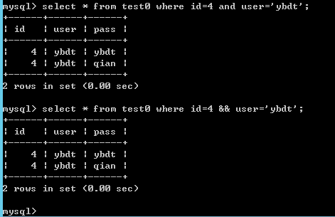

1、內联注释
```
/*!*/
解释：mysql为了兼容其他数据库，将mysql中特有的东西放入其中，如/*!STRAIGHT_JOIN*/，这样在其他数据库中会将其视为注释，但在mysql中会解释执行
```
```
/*!50110STRAIGHT_JOIN*/
解释：表示此语句仅在mysql版本大于等于5.1.10时才执行
```
参考链接：  
https://blog.csdn.net/herojuice/article/details/85136922  
https://www.cnblogs.com/itcomputer/articles/5253263.html  
https://dev.mysql.com/doc/refman/5.7/en/comments.html  
参考实例：  
https://mp.weixin.qq.com/s/84se5CxYlVT05bcw654wKg 这篇文章用到了上述的技巧绕过了Mod_Security

2、寻找替代  
2.1、可用&&代替and，如下图  
  
2.2、可用true代替and 1=1以及用false代替and 1=2，如下图  


3、通过注释分割关键字  
```
可用database/**/()代替database()
```
如下图  

